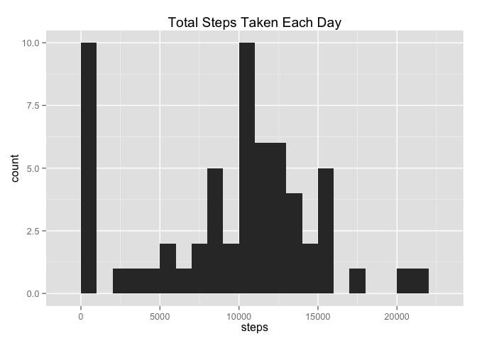
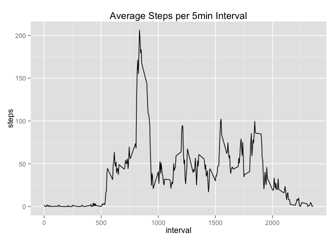
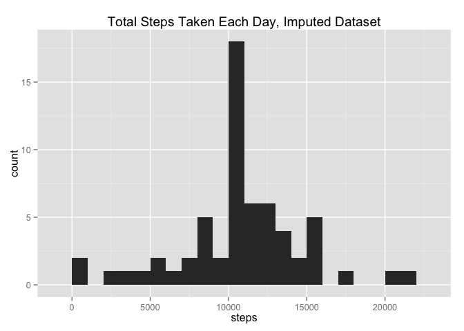
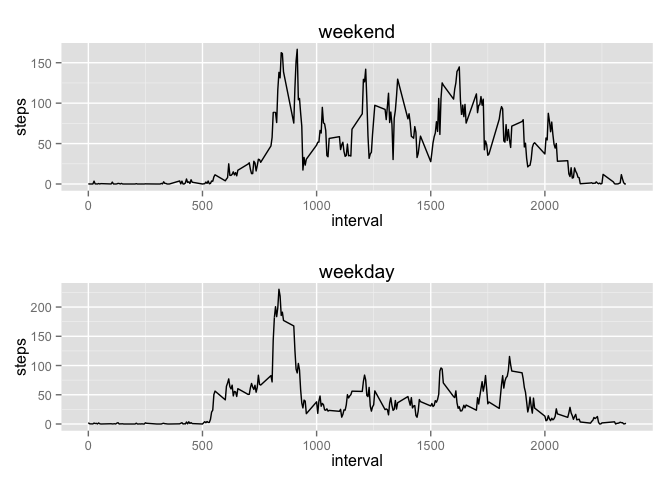

# Reproducible Research: Peer Assessment 1


```r
# - load packages
library(dplyr)          # - data manipulation
library(ggplot2)        # - plotting
library(gridExtra)      # - panel plots
```


## Loading and preprocessing the data

```r
# - read in the zipped csv file (without unzipping it on disk)
activity_data <- read.csv(unz("activity.zip", "activity.csv"),
                          stringsAsFactors=FALSE)

# - convert date variable from string to date object
activity_data <- activity_data %>%
                 mutate(date = as.Date(date, format="%Y-%m-%d"))
```


## What is mean total number of steps taken per day?

```r
# - calculate the total number of steps taken per day
steps_per_day <- activity_data %>% 
                 group_by(date) %>% 
                 summarise(steps=sum(steps,na.rm=TRUE))

# - make a histogram of the total number of steps taken each day
qplot(x=steps, 
      data=steps_per_day, 
      geom="histogram", 
      binwidth=1000,
      main="Total Steps Taken Each Day")
```

 

```r
# - calculate and report the mean and median of the total number 
#   of steps taken per day
mean_steps <- mean(steps_per_day$steps)
median_steps <- median(steps_per_day$steps)
```
The mean total number of steps per day is: **9,354**  
The median total number of steps per day is: **10,395**  


## What is the average daily activity pattern?

```r
# - calculate the average steps per 5-min interval
avg_steps_per_inter <- activity_data %>%
                       group_by(interval) %>%
                       summarise(steps=mean(steps, na.rm=TRUE))

# - time series plot of the 5-minute interval (x-axis) and the average number
#   of steps taken, averaged across all days (y-axis)
qplot(x=interval, 
      y=steps, 
      data=avg_steps_per_inter, 
      geom="line", 
      main="Average Steps per 5min Interval")
```

 

```r
# - max steps across 5-minute intervals
max_steps_interval <- top_n(avg_steps_per_inter, n=1, steps)
```
Interval **835**, on average across all days, contrains the maximum number of steps of **206**  


## Imputing missing values

```r
# - tally the number of rows with missing step entries
na_rows <- sum(is.na(activity_data$steps))

# - impute NAs using the mean for that 5-minute interval
activity_data_imputed <- activity_data %>%
                         group_by(interval) %>%
                         mutate(steps = ifelse(is.na(steps), 
                                               mean(steps, na.rm=TRUE),
                                               steps))

# - calculate the total number of steps taken per day for imputed dataset
steps_per_day_imputed <- activity_data_imputed %>% 
                         group_by(date) %>% 
                         summarise(steps=sum(steps,na.rm=TRUE))

# - make a histogram of the total number of steps taken each day 
qplot(x=steps, 
      data=steps_per_day_imputed, 
      geom="histogram", 
      binwidth=1000,
      main="Total Steps Taken Each Day, Imputed Dataset")
```

 

```r
# - calculate the mean and median total number of steps taken per day. 
mean_steps_imputed <- mean(steps_per_day_imputed$steps)
median_steps_imputed <- median(steps_per_day_imputed$steps)
```
The original dataset had **2304** rows with missing values  
The mean total number of steps per day for the imputed data set is: **10,766**  
... difference from non-imputed mean is: **1,412**  
The median total number of steps per day for the imputed data set is: **10,766**  
... difference from non-imputed meadian is: **371**  


## Are there differences in activity patterns between weekdays and weekends?

```r
# - use the dataset with the filled-in missing values for this part.

# - create a new factor variable in the dataset with two levels – “weekday” 
#   and “weekend” indicating whether a given date is a weekday or weekend day.
activity_data_dow <- activity_data_imputed %>%
                     mutate(
                         day_name = weekdays(date),
                         part_bool = ifelse(day_name %in% c("Saturday", "Sunday"), 0, 1),
                         part_of_week = factor(part_bool, labels=c("weekend", "weekday"))) %>%
                     select(-day_name, -part_bool)

# - compute average steps per interval for both weekend and weekdays
dow_avg_steps_per_inter <- activity_data_dow %>%
                           group_by(part_of_week, interval) %>%
                           summarise(steps=mean(steps, na.rm=TRUE))

# - panel plot containing a time series of the 5-minute interval (x-axis) and 
#   the average number of steps taken, averaged across all weekday days and 
#   weekend days (y-axis). 
weekend_plot <- qplot(x=interval, y=steps, 
                      data=filter(dow_avg_steps_per_inter, part_of_week=="weekend"),
                      geom="line", 
                      main="weekend")
weekday_plot <- qplot(x=interval, y=steps, 
                      data=filter(dow_avg_steps_per_inter, part_of_week=="weekday"),
                      geom="line", 
                      main="weekday")
grid.arrange(weekend_plot, weekday_plot, nrow=2)
```

 


